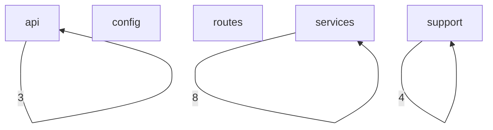
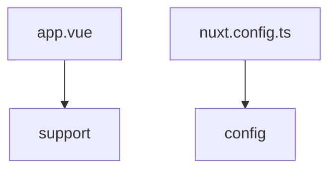
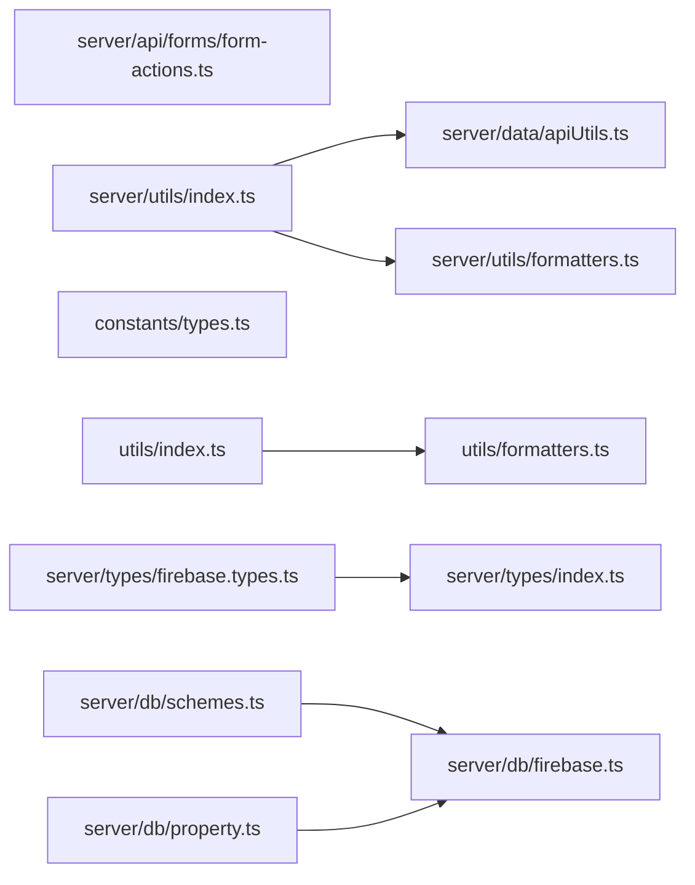

# Flow

## Flow Document Purpose

- Repository: `real-estate-nuxt`
- Category: `frontend`
- This document explains how the codebase is wired together using actual local file imports when they are available.
- Folder names and path categories are used only as a fallback when an exact runtime link is not directly visible from source imports.
- Mermaid diagrams below are repository-local diagrams intended for scanning architecture flow, not pixel-perfect runtime sequence diagrams.
- External services are called out only when the repository declares them in code or package metadata.

## Reading Guide

- `Entry points` are files that appear to bootstrap the app, server, router, or top-level runtime.
- `Outgoing links` are local repository imports from one file to another.
- `Incoming links` are local repository files that import the current file.
- `External packages` are package imports seen in source files and are listed separately from local file links.
- `Flow position` is derived from the file category plus observed import relationships.

## Repository Surface Snapshot

- Total scanned files: `155`
- Files with local outgoing imports: `14`
- Files with local incoming imports: `9`
- Root directories: `18`
- Root files: `12`
- Category count: `5`

## Top-Level Directories

- `.github/`
- `.vscode/`
- `assets/`
- `components/`
- `composables/`
- `constants/`
- `docs/`
- `layouts/`
- `middleware/`
- `pages/`
- `plugins/`
- `public/`
- `schemas/`
- `server/`
- `shared/`
- `stores/`
- `types/`
- `utils/`

## Top-Level Files

- `.gitignore`
- `.prettierrc`
- `DOCS.md`
- `LICENSE.txt`
- `README.md`
- `app.vue`
- `eslint.config.mjs`
- `nuxt.config.ts`
- `package.json`
- `pnpm-lock.yaml`
- `tailwind.config.ts`
- `tsconfig.json`

## Category Inventory

- `api`: `7` files
- `config`: `5` files
- `routes`: `8` files
- `services`: `16` files
- `support`: `119` files

## Entry Points

- `app.vue`
- `nuxt.config.ts`

## Category-Level Diagram

## Entry Flow Diagram

## Hotspot File Diagram

## Category Flow Notes

- `api` exports `3` observed category-to-category local links and receives `3` incoming category links
- `config` exports `0` observed category-to-category local links and receives `0` incoming category links
- `routes` exports `0` observed category-to-category local links and receives `0` incoming category links
- `services` exports `8` observed category-to-category local links and receives `8` incoming category links
- `support` exports `4` observed category-to-category local links and receives `4` incoming category links

## File-Level Flow Inventory

### `api` Layer

- File: `server/api/admin/get-contacts.ts`
- Flow position: `api`
- Local outgoing link count: `1`
- Outgoing -> `server/api/forms/form-actions.ts`
- Local incoming link count: `0`
- Incoming <- `None confirmed from local imports`
- External -> `None confirmed from import statements`
-
- File: `server/api/forms/contact.ts`
- Flow position: `api`
- Local outgoing link count: `1`
- Outgoing -> `server/api/forms/form-actions.ts`
- Local incoming link count: `0`
- Incoming <- `None confirmed from local imports`
- External package link count: `2`
- External -> `zod`
- External -> `~/schemas/formSchemas`
-
- File: `server/api/forms/form-actions.ts`
- Flow position: `api`
- Local outgoing link count: `0`
- Outgoing -> `None confirmed from local imports`
- Local incoming link count: `3`
- Incoming <- `server/api/admin/get-contacts.ts`
- Incoming <- `server/api/forms/contact.ts`
- Incoming <- `server/api/forms/inquiry.ts`
- External package link count: `2`
- External -> `firebase/firestore`
- External -> `~/server/db/firebase`
-
- File: `server/api/forms/inquiry.ts`
- Flow position: `api`
- Local outgoing link count: `1`
- Outgoing -> `server/api/forms/form-actions.ts`
- Local incoming link count: `0`
- Incoming <- `None confirmed from local imports`
- External package link count: `2`
- External -> `zod`
- External -> `~/schemas/formSchemas`
-
- File: `server/api/properties/id.ts`
- Flow position: `api`
- Local outgoing link count: `0`
- Outgoing -> `None confirmed from local imports`
- Local incoming link count: `0`
- Incoming <- `None confirmed from local imports`
- External package link count: `1`
- External -> `~/server/data/apiUtils`
-
- File: `server/api/properties/index.ts`
- Flow position: `api`
- Local outgoing link count: `0`
- Outgoing -> `None confirmed from local imports`
- Local incoming link count: `0`
- Incoming <- `None confirmed from local imports`
- External package link count: `1`
- External -> `~/server/data`
-
- File: `server/api/test/index.ts`
- Flow position: `api`
- Local outgoing link count: `0`
- Outgoing -> `None confirmed from local imports`
- Local incoming link count: `0`
- Incoming <- `None confirmed from local imports`
- External package link count: `2`
- External -> `firebase/firestore`
- External -> `~/server/db/firebase`
-

### `config` Layer

- File: `eslint.config.mjs`
- Flow position: `config`
- Local outgoing link count: `0`
- Outgoing -> `None confirmed from local imports`
- Local incoming link count: `0`
- Incoming <- `None confirmed from local imports`
- External -> `None confirmed from import statements`
-
- File: `nuxt.config.ts`
- Flow position: `config`
- Local outgoing link count: `0`
- Outgoing -> `None confirmed from local imports`
- Local incoming link count: `0`
- Incoming <- `None confirmed from local imports`
- External package link count: `1`
- External -> `nuxt/config`
-
- File: `schemas/formSchemas.ts`
- Flow position: `config`
- Local outgoing link count: `0`
- Outgoing -> `None confirmed from local imports`
- Local incoming link count: `0`
- Incoming <- `None confirmed from local imports`
- External package link count: `1`
- External -> `zod`
-
- File: `tailwind.config.ts`
- Flow position: `config`
- Local outgoing link count: `0`
- Outgoing -> `None confirmed from local imports`
- Local incoming link count: `0`
- Incoming <- `None confirmed from local imports`
- External package link count: `1`
- External -> `tailwindcss`
-
- File: `tsconfig.json`
- Flow position: `config`
- Local outgoing link count: `0`
- Outgoing -> `None confirmed from local imports`
- Local incoming link count: `0`
- Incoming <- `None confirmed from local imports`
- External -> `None confirmed from import statements`
-

### `routes` Layer

- File: `pages/AboutUs.vue`
- Flow position: `routes`
- Local outgoing link count: `0`
- Outgoing -> `None confirmed from local imports`
- Local incoming link count: `0`
- Incoming <- `None confirmed from local imports`
- External -> `None confirmed from import statements`
-
- File: `pages/Contact.vue`
- Flow position: `routes`
- Local outgoing link count: `0`
- Outgoing -> `None confirmed from local imports`
- Local incoming link count: `0`
- Incoming <- `None confirmed from local imports`
- External package link count: `3`
- External -> `~/constants`
- External -> `~/constants/toaster`
- External -> `~/schemas/formSchemas`
-
- File: `pages/Properties/[slugId].vue`
- Flow position: `routes`
- Local outgoing link count: `0`
- Outgoing -> `None confirmed from local imports`
- Local incoming link count: `0`
- Incoming <- `None confirmed from local imports`
- External package link count: `3`
- External -> `#imports`
- External -> `~/server/utils/`
- External -> `~/utils/formatters`
-
- File: `pages/Properties/index.vue`
- Flow position: `routes`
- Local outgoing link count: `0`
- Outgoing -> `None confirmed from local imports`
- Local incoming link count: `0`
- Incoming <- `None confirmed from local imports`
- External package link count: `4`
- External -> `@/constants/toaster`
- External -> `~/components/organisms/CardWrapper.vue`
- External -> `~/components/properties/SearchProperty.vue`
- External -> `~/schemas/formSchemas`
-
- File: `pages/Services.vue`
- Flow position: `routes`
- Local outgoing link count: `0`
- Outgoing -> `None confirmed from local imports`
- Local incoming link count: `0`
- Incoming <- `None confirmed from local imports`
- External package link count: `1`
- External -> `~/constants`
-
- File: `pages/Test.vue`
- Flow position: `routes`
- Local outgoing link count: `0`
- Outgoing -> `None confirmed from local imports`
- Local incoming link count: `0`
- Incoming <- `None confirmed from local imports`
- External -> `None confirmed from import statements`
-
- File: `pages/admin/index.vue`
- Flow position: `routes`
- Local outgoing link count: `0`
- Outgoing -> `None confirmed from local imports`
- Local incoming link count: `0`
- Incoming <- `None confirmed from local imports`
- External package link count: `1`
- External -> `@vueuse/core`
-
- File: `pages/index.vue`
- Flow position: `routes`
- Local outgoing link count: `0`
- Outgoing -> `None confirmed from local imports`
- Local incoming link count: `0`
- Incoming <- `None confirmed from local imports`
- External package link count: `2`
- External -> `~/components/organisms/CardWrapper.vue`
- External -> `~/constants/index`
-

### `services` Layer

- File: `server/data/apiUtils.ts`
- Flow position: `services`
- Local outgoing link count: `1`
- Outgoing -> `server/data/index.ts`
- Local incoming link count: `1`
- Incoming <- `server/utils/index.ts`
- External -> `None confirmed from import statements`
-
- File: `server/data/index.ts`
- Flow position: `services`
- Local outgoing link count: `0`
- Outgoing -> `None confirmed from local imports`
- Local incoming link count: `1`
- Incoming <- `server/data/apiUtils.ts`
- External -> `None confirmed from import statements`
-
- File: `server/db/actions.ts`
- Flow position: `services`
- Local outgoing link count: `1`
- Outgoing -> `server/db/firebase.ts`
- Local incoming link count: `0`
- Incoming <- `None confirmed from local imports`
- External package link count: `1`
- External -> `firebase/firestore`
-
- File: `server/db/firebase.ts`
- Flow position: `services`
- Local outgoing link count: `0`
- Outgoing -> `None confirmed from local imports`
- Local incoming link count: `4`
- Incoming <- `server/db/actions.ts`
- Incoming <- `server/db/forms.ts`
- Incoming <- `server/db/property.ts`
- Incoming <- `server/db/schemes.ts`
- External package link count: `2`
- External -> `firebase/app`
- External -> `firebase/firestore`
-
- File: `server/db/forms.ts`
- Flow position: `services`
- Local outgoing link count: `1`
- Outgoing -> `server/db/firebase.ts`
- Local incoming link count: `0`
- Incoming <- `None confirmed from local imports`
- External package link count: `1`
- External -> `firebase/firestore`
-
- File: `server/db/property.ts`
- Flow position: `services`
- Local outgoing link count: `1`
- Outgoing -> `server/db/firebase.ts`
- Local incoming link count: `0`
- Incoming <- `None confirmed from local imports`
- External package link count: `1`
- External -> `firebase/firestore`
-
- File: `server/db/schemes.ts`
- Flow position: `services`
- Local outgoing link count: `1`
- Outgoing -> `server/db/firebase.ts`
- Local incoming link count: `0`
- Incoming <- `None confirmed from local imports`
- External package link count: `1`
- External -> `firebase/firestore`
-
- File: `server/db/users.ts`
- Flow position: `services`
- Local outgoing link count: `0`
- Outgoing -> `None confirmed from local imports`
- Local incoming link count: `0`
- Incoming <- `None confirmed from local imports`
- External package link count: `3`
- External -> `firebase/firestore`
- External -> `h3`
- External -> `~/server/db/firebase`
-
- File: `server/middelware/log.ts`
- Flow position: `services`
- Local outgoing link count: `0`
- Outgoing -> `None confirmed from local imports`
- Local incoming link count: `0`
- Incoming <- `None confirmed from local imports`
- External -> `None confirmed from import statements`
-
- File: `server/tsconfig.json`
- Flow position: `services`
- Local outgoing link count: `0`
- Outgoing -> `None confirmed from local imports`
- Local incoming link count: `0`
- Incoming <- `None confirmed from local imports`
- External -> `None confirmed from import statements`
-
- File: `server/types/firebase.types.ts`
- Flow position: `services`
- Local outgoing link count: `1`
- Outgoing -> `server/types/index.ts`
- Local incoming link count: `0`
- Incoming <- `None confirmed from local imports`
- External package link count: `1`
- External -> `firebase/firestore`
-
- File: `server/types/index.ts`
- Flow position: `services`
- Local outgoing link count: `0`
- Outgoing -> `None confirmed from local imports`
- Local incoming link count: `1`
- Incoming <- `server/types/firebase.types.ts`
- External -> `None confirmed from import statements`
-
- File: `server/types/property.types.ts`
- Flow position: `services`
- Local outgoing link count: `0`
- Outgoing -> `None confirmed from local imports`
- Local incoming link count: `0`
- Incoming <- `None confirmed from local imports`
- External -> `None confirmed from import statements`
-
- File: `server/utils/formatters.ts`
- Flow position: `services`
- Local outgoing link count: `0`
- Outgoing -> `None confirmed from local imports`
- Local incoming link count: `1`
- Incoming <- `server/utils/index.ts`
- External package link count: `1`
- External -> `~/utils/formatters`
-
- File: `server/utils/handler.ts`
- Flow position: `services`
- Local outgoing link count: `0`
- Outgoing -> `None confirmed from local imports`
- Local incoming link count: `0`
- Incoming <- `None confirmed from local imports`
- External package link count: `1`
- External -> `h3`
-
- File: `server/utils/index.ts`
- Flow position: `services`
- Local outgoing link count: `2`
- Outgoing -> `server/data/apiUtils.ts`
- Outgoing -> `server/utils/formatters.ts`
- Local incoming link count: `0`
- Incoming <- `None confirmed from local imports`
- External -> `None confirmed from import statements`
-

### `support` Layer

- File: `.github/dependabot.yml`
- Flow position: `support`
- Local outgoing link count: `0`
- Outgoing -> `None confirmed from local imports`
- Local incoming link count: `0`
- Incoming <- `None confirmed from local imports`
- External -> `None confirmed from import statements`
-
- File: `app.vue`
- Flow position: `support`
- Local outgoing link count: `0`
- Outgoing -> `None confirmed from local imports`
- Local incoming link count: `0`
- Incoming <- `None confirmed from local imports`
- External package link count: `1`
- External -> `~/assets/css/tailwind.css`
-
- File: `assets/css/tailwind.css`
- Flow position: `support`
- Local outgoing link count: `0`
- Outgoing -> `None confirmed from local imports`
- Local incoming link count: `0`
- Incoming <- `None confirmed from local imports`
- External -> `None confirmed from import statements`
-
- File: `components/ContactForm.vue`
- Flow position: `support`
- Local outgoing link count: `0`
- Outgoing -> `None confirmed from local imports`
- Local incoming link count: `0`
- Incoming <- `None confirmed from local imports`
- External package link count: `1`
- External -> `zod`
-
- File: `components/DynamicHero.vue`
- Flow position: `support`
- Local outgoing link count: `0`
- Outgoing -> `None confirmed from local imports`
- Local incoming link count: `0`
- Incoming <- `None confirmed from local imports`
- External -> `None confirmed from import statements`
-
- File: `components/FeaturedPropertyCard.vue`
- Flow position: `support`
- Local outgoing link count: `0`
- Outgoing -> `None confirmed from local imports`
- Local incoming link count: `0`
- Incoming <- `None confirmed from local imports`
- External package link count: `1`
- External -> `~/components/properties/ReadMore.vue`
-
- File: `components/InfoHighLightBox.vue`
- Flow position: `support`
- Local outgoing link count: `0`
- Outgoing -> `None confirmed from local imports`
- Local incoming link count: `0`
- Incoming <- `None confirmed from local imports`
- External -> `None confirmed from import statements`
-
- File: `components/InquiryForm.vue`
- Flow position: `support`
- Local outgoing link count: `0`
- Outgoing -> `None confirmed from local imports`
- Local incoming link count: `0`
- Incoming <- `None confirmed from local imports`
- External -> `None confirmed from import statements`
-
- File: `components/PaginationInfo.vue`
- Flow position: `support`
- Local outgoing link count: `0`
- Outgoing -> `None confirmed from local imports`
- Local incoming link count: `0`
- Incoming <- `None confirmed from local imports`
- External -> `None confirmed from import statements`
-
- File: `components/PaginationWrapper.vue`
- Flow position: `support`
- Local outgoing link count: `0`
- Outgoing -> `None confirmed from local imports`
- Local incoming link count: `0`
- Incoming <- `None confirmed from local imports`
- External package link count: `1`
- External -> `@vueuse/core`
-
- File: `components/PropertyInquriryForm.vue`
- Flow position: `support`
- Local outgoing link count: `0`
- Outgoing -> `None confirmed from local imports`
- Local incoming link count: `0`
- Incoming <- `None confirmed from local imports`
- External package link count: `3`
- External -> `vue`
- External -> `vue-router`
- External -> `zod`
-
- File: `components/ServiceCard.vue`
- Flow position: `support`
- Local outgoing link count: `0`
- Outgoing -> `None confirmed from local imports`
- Local incoming link count: `0`
- Incoming <- `None confirmed from local imports`
- External -> `None confirmed from import statements`
-
- File: `components/SiteFooter.vue`
- Flow position: `support`
- Local outgoing link count: `0`
- Outgoing -> `None confirmed from local imports`
- Local incoming link count: `0`
- Incoming <- `None confirmed from local imports`
- External package link count: `4`
- External -> `~/assets/socialMedia/facebook.svg`
- External -> `~/assets/socialMedia/in.svg`
- External -> `~/assets/socialMedia/twitter.svg`
- External -> `~/assets/socialMedia/youtube.svg`
-
- File: `components/SiteHeader.vue`
- Flow position: `support`
- Local outgoing link count: `0`
- Outgoing -> `None confirmed from local imports`
- Local incoming link count: `0`
- Incoming <- `None confirmed from local imports`
- External package link count: `1`
- External -> `~/components/organisms/MobileMenu.vue`
-
- File: `components/atoms/ArrowButton.vue`
- Flow position: `support`
- Local outgoing link count: `0`
- Outgoing -> `None confirmed from local imports`
- Local incoming link count: `0`
- Incoming <- `None confirmed from local imports`
- External -> `None confirmed from import statements`
-
- File: `components/atoms/BaseNavLink.vue`
- Flow position: `support`
- Local outgoing link count: `0`
- Outgoing -> `None confirmed from local imports`
- Local incoming link count: `0`
- Incoming <- `None confirmed from local imports`
- External package link count: `1`
- External -> `#components`
-
- File: `components/atoms/Button.vue`
- Flow position: `support`
- Local outgoing link count: `0`
- Outgoing -> `None confirmed from local imports`
- Local incoming link count: `0`
- Incoming <- `None confirmed from local imports`
- External -> `None confirmed from import statements`
-
- File: `components/atoms/CardPaginationStatus.vue`
- Flow position: `support`
- Local outgoing link count: `0`
- Outgoing -> `None confirmed from local imports`
- Local incoming link count: `0`
- Incoming <- `None confirmed from local imports`
- External -> `None confirmed from import statements`
-
- File: `components/atoms/FooterInput.vue`
- Flow position: `support`
- Local outgoing link count: `0`
- Outgoing -> `None confirmed from local imports`
- Local incoming link count: `0`
- Incoming <- `None confirmed from local imports`
- External -> `None confirmed from import statements`
-
- File: `components/atoms/GalleryImage.vue`
- Flow position: `support`
- Local outgoing link count: `0`
- Outgoing -> `None confirmed from local imports`
- Local incoming link count: `0`
- Incoming <- `None confirmed from local imports`
- External -> `None confirmed from import statements`
-
- File: `components/atoms/IconBadge.vue`
- Flow position: `support`
- Local outgoing link count: `0`
- Outgoing -> `None confirmed from local imports`
- Local incoming link count: `0`
- Incoming <- `None confirmed from local imports`
- External -> `None confirmed from import statements`
-
- File: `components/atoms/InfoItem.vue`
- Flow position: `support`
- Local outgoing link count: `0`
- Outgoing -> `None confirmed from local imports`
- Local incoming link count: `0`
- Incoming <- `None confirmed from local imports`
- External -> `None confirmed from import statements`
-
- File: `components/atoms/Input.vue`
- Flow position: `support`
- Local outgoing link count: `0`
- Outgoing -> `None confirmed from local imports`
- Local incoming link count: `0`
- Incoming <- `None confirmed from local imports`
- External -> `None confirmed from import statements`
-
- File: `components/atoms/InputCheckbox.vue`
- Flow position: `support`
- Local outgoing link count: `0`
- Outgoing -> `None confirmed from local imports`
- Local incoming link count: `1`
- Incoming <- `components/molecules/PrefInputs.vue`
- External -> `None confirmed from import statements`
-
- File: `components/atoms/InputSvg.vue`
- Flow position: `support`
- Local outgoing link count: `0`
- Outgoing -> `None confirmed from local imports`
- Local incoming link count: `0`
- Incoming <- `None confirmed from local imports`
- External -> `None confirmed from import statements`
-
- File: `components/atoms/LeftArrow.vue`
- Flow position: `support`
- Local outgoing link count: `0`
- Outgoing -> `None confirmed from local imports`
- Local incoming link count: `0`
- Incoming <- `None confirmed from local imports`
- External package link count: `1`
- External -> `@/stores/modalStore`
-
- File: `components/atoms/ListHead.vue`
- Flow position: `support`
- Local outgoing link count: `0`
- Outgoing -> `None confirmed from local imports`
- Local incoming link count: `0`
- Incoming <- `None confirmed from local imports`
- External -> `None confirmed from import statements`
-
- File: `components/atoms/Logo.vue`
- Flow position: `support`
- Local outgoing link count: `0`
- Outgoing -> `None confirmed from local imports`
- Local incoming link count: `0`
- Incoming <- `None confirmed from local imports`
- External -> `None confirmed from import statements`
-
- File: `components/atoms/PaginationButton.vue`
- Flow position: `support`
- Local outgoing link count: `0`
- Outgoing -> `None confirmed from local imports`
- Local incoming link count: `0`
- Incoming <- `None confirmed from local imports`
- External package link count: `1`
- External -> `~/stores/pagination`
-
- File: `components/atoms/PopUp.vue`
- Flow position: `support`
- Local outgoing link count: `0`
- Outgoing -> `None confirmed from local imports`
- Local incoming link count: `0`
- Incoming <- `None confirmed from local imports`
- External -> `None confirmed from import statements`
-
- File: `components/atoms/Preferred.vue`
- Flow position: `support`
- Local outgoing link count: `0`
- Outgoing -> `None confirmed from local imports`
- Local incoming link count: `0`
- Incoming <- `None confirmed from local imports`
- External -> `None confirmed from import statements`
-
- File: `components/atoms/PrefferedInputs.vue`
- Flow position: `support`
- Local outgoing link count: `0`
- Outgoing -> `None confirmed from local imports`
- Local incoming link count: `0`
- Incoming <- `None confirmed from local imports`
- External package link count: `1`
- External -> `vue`
-
- File: `components/atoms/Search.vue`
- Flow position: `support`
- Local outgoing link count: `0`
- Outgoing -> `None confirmed from local imports`
- Local incoming link count: `0`
- Incoming <- `None confirmed from local imports`
- External -> `None confirmed from import statements`
-
- File: `components/atoms/SelectInput.vue`
- Flow position: `support`
- Local outgoing link count: `0`
- Outgoing -> `None confirmed from local imports`
- Local incoming link count: `0`
- Incoming <- `None confirmed from local imports`
- External -> `None confirmed from import statements`
-
- File: `components/atoms/StarRating.vue`
- Flow position: `support`
- Local outgoing link count: `0`
- Outgoing -> `None confirmed from local imports`
- Local incoming link count: `0`
- Incoming <- `None confirmed from local imports`
- External -> `None confirmed from import statements`
-
- File: `components/atoms/TabIndicator.vue`
- Flow position: `support`
- Local outgoing link count: `0`
- Outgoing -> `None confirmed from local imports`
- Local incoming link count: `0`
- Incoming <- `None confirmed from local imports`
- External -> `None confirmed from import statements`
-
- File: `components/molecules/CardPaginator.vue`
- Flow position: `support`
- Local outgoing link count: `0`
- Outgoing -> `None confirmed from local imports`
- Local incoming link count: `0`
- Incoming <- `None confirmed from local imports`
- External -> `None confirmed from import statements`
-
- File: `components/molecules/CardThree.vue`
- Flow position: `support`
- Local outgoing link count: `0`
- Outgoing -> `None confirmed from local imports`
- Local incoming link count: `0`
- Incoming <- `None confirmed from local imports`
- External -> `None confirmed from import statements`
-
- File: `components/molecules/CardThreeDesk.vue`
- Flow position: `support`
- Local outgoing link count: `0`
- Outgoing -> `None confirmed from local imports`
- Local incoming link count: `0`
- Incoming <- `None confirmed from local imports`
- External -> `None confirmed from import statements`
-
- File: `components/molecules/CircleCTA.vue`
- Flow position: `support`
- Local outgoing link count: `0`
- Outgoing -> `None confirmed from local imports`
- Local incoming link count: `0`
- Incoming <- `None confirmed from local imports`
- External package link count: `1`
- External -> `circletype`
-
- File: `components/molecules/ContactLocationCard.vue`
- Flow position: `support`
- Local outgoing link count: `0`
- Outgoing -> `None confirmed from local imports`
- Local incoming link count: `0`
- Incoming <- `None confirmed from local imports`
- External -> `None confirmed from import statements`
-
- File: `components/molecules/ExploreCard.vue`
- Flow position: `support`
- Local outgoing link count: `0`
- Outgoing -> `None confirmed from local imports`
- Local incoming link count: `0`
- Incoming <- `None confirmed from local imports`
- External -> `None confirmed from import statements`
-
- File: `components/molecules/FaqCard.vue`
- Flow position: `support`
- Local outgoing link count: `0`
- Outgoing -> `None confirmed from local imports`
- Local incoming link count: `0`
- Incoming <- `None confirmed from local imports`
- External package link count: `3`
- External -> `#components`
- External -> `~/constants/types`
- External -> `~/stores/maintanceModal`
-
- File: `components/molecules/ImageNavigator.vue`
- Flow position: `support`
- Local outgoing link count: `0`
- Outgoing -> `None confirmed from local imports`
- Local incoming link count: `0`
- Incoming <- `None confirmed from local imports`
- External -> `None confirmed from import statements`
-
- File: `components/molecules/ListingBox.vue`
- Flow position: `support`
- Local outgoing link count: `0`
- Outgoing -> `None confirmed from local imports`
- Local incoming link count: `0`
- Incoming <- `None confirmed from local imports`
- External package link count: `1`
- External -> `~/constants/types`
-
- File: `components/molecules/MainBox.vue`
- Flow position: `support`
- Local outgoing link count: `0`
- Outgoing -> `None confirmed from local imports`
- Local incoming link count: `0`
- Incoming <- `None confirmed from local imports`
- External -> `None confirmed from import statements`
-
- File: `components/molecules/OurValuedClients.vue`
- Flow position: `support`
- Local outgoing link count: `0`
- Outgoing -> `None confirmed from local imports`
- Local incoming link count: `0`
- Incoming <- `None confirmed from local imports`
- External package link count: `1`
- External -> `@/components/atoms/Button.vue`
-
- File: `components/molecules/PrefInputs.vue`
- Flow position: `support`
- Local outgoing link count: `1`
- Outgoing -> `components/atoms/InputCheckbox.vue`
- Local incoming link count: `0`
- Incoming <- `None confirmed from local imports`
- External -> `None confirmed from import statements`
-
- File: `components/molecules/ProfileCard.vue`
- Flow position: `support`
- Local outgoing link count: `0`
- Outgoing -> `None confirmed from local imports`
- Local incoming link count: `0`
- Incoming <- `None confirmed from local imports`
- External -> `None confirmed from import statements`
-
- File: `components/molecules/RepeatedBlock.vue`
- Flow position: `support`
- Local outgoing link count: `0`
- Outgoing -> `None confirmed from local imports`
- Local incoming link count: `0`
- Incoming <- `None confirmed from local imports`
- External -> `None confirmed from import statements`
-
- File: `components/molecules/SearchBox.vue`
- Flow position: `support`
- Local outgoing link count: `0`
- Outgoing -> `None confirmed from local imports`
- Local incoming link count: `0`
- Incoming <- `None confirmed from local imports`
- External package link count: `1`
- External -> `minisearch`
-
- File: `components/molecules/SearchBoxTwo.vue`
- Flow position: `support`
- Local outgoing link count: `0`
- Outgoing -> `None confirmed from local imports`
- Local incoming link count: `0`
- Incoming <- `None confirmed from local imports`
- External package link count: `1`
- External -> `minisearch`
-
- File: `components/molecules/SliderControl.vue`
- Flow position: `support`
- Local outgoing link count: `0`
- Outgoing -> `None confirmed from local imports`
- Local incoming link count: `0`
- Incoming <- `None confirmed from local imports`
- External -> `None confirmed from import statements`
-
- File: `components/molecules/SortInput.vue`
- Flow position: `support`
- Local outgoing link count: `0`
- Outgoing -> `None confirmed from local imports`
- Local incoming link count: `0`
- Incoming <- `None confirmed from local imports`
- External -> `None confirmed from import statements`
-
- File: `components/molecules/TestimonialCard.vue`
- Flow position: `support`
- Local outgoing link count: `0`
- Outgoing -> `None confirmed from local imports`
- Local incoming link count: `0`
- Incoming <- `None confirmed from local imports`
- External package link count: `2`
- External -> `~/components/atoms/StarRating.vue`
- External -> `~/constants/types`
-
- File: `components/molecules/UnlockBox.vue`
- Flow position: `support`
- Local outgoing link count: `0`
- Outgoing -> `None confirmed from local imports`
- Local incoming link count: `0`
- Incoming <- `None confirmed from local imports`
- External -> `None confirmed from import statements`
-
- File: `components/molecules/ViewButton.vue`
- Flow position: `support`
- Local outgoing link count: `0`
- Outgoing -> `None confirmed from local imports`
- Local incoming link count: `0`
- Incoming <- `None confirmed from local imports`
- External package link count: `1`
- External -> `@vueuse/core`
-
- File: `components/molecules/WhatOurClient.vue`
- Flow position: `support`
- Local outgoing link count: `0`
- Outgoing -> `None confirmed from local imports`
- Local incoming link count: `0`
- Incoming <- `None confirmed from local imports`
- External -> `None confirmed from import statements`
-
- File: `components/organisms/AboutHeroDesk.vue`
- Flow position: `support`
- Local outgoing link count: `0`
- Outgoing -> `None confirmed from local imports`
- Local incoming link count: `0`
- Incoming <- `None confirmed from local imports`
- External -> `None confirmed from import statements`
-
- File: `components/organisms/BoxInput.vue`
- Flow position: `support`
- Local outgoing link count: `0`
- Outgoing -> `None confirmed from local imports`
- Local incoming link count: `0`
- Incoming <- `None confirmed from local imports`
- External -> `None confirmed from import statements`
-
- File: `components/organisms/CardHeader.vue`
- Flow position: `support`
- Local outgoing link count: `0`
- Outgoing -> `None confirmed from local imports`
- Local incoming link count: `0`
- Incoming <- `None confirmed from local imports`
- External -> `None confirmed from import statements`
-
- File: `components/organisms/CardTAbout.vue`
- Flow position: `support`
- Local outgoing link count: `0`
- Outgoing -> `None confirmed from local imports`
- Local incoming link count: `0`
- Incoming <- `None confirmed from local imports`
- External -> `None confirmed from import statements`
-
- File: `components/organisms/CardWrapper.vue`
- Flow position: `support`
- Local outgoing link count: `0`
- Outgoing -> `None confirmed from local imports`
- Local incoming link count: `0`
- Incoming <- `None confirmed from local imports`
- External package link count: `1`
- External -> `@vueuse/core`
-
- File: `components/organisms/ColumnFourthCard.vue`
- Flow position: `support`
- Local outgoing link count: `0`
- Outgoing -> `None confirmed from local imports`
- Local incoming link count: `0`
- Incoming <- `None confirmed from local imports`
- External -> `None confirmed from import statements`
-
- File: `components/organisms/HeroDesktop.vue`
- Flow position: `support`
- Local outgoing link count: `0`
- Outgoing -> `None confirmed from local imports`
- Local incoming link count: `0`
- Incoming <- `None confirmed from local imports`
- External package link count: `2`
- External -> `~/components/molecules/CircleCTA.vue`
- External -> `~/constants/index`
-
- File: `components/organisms/HeroHighlight.vue`
- Flow position: `support`
- Local outgoing link count: `0`
- Outgoing -> `None confirmed from local imports`
- Local incoming link count: `0`
- Incoming <- `None confirmed from local imports`
- External package link count: `1`
- External -> `~/types`
-
- File: `components/organisms/HeroMobile.vue`
- Flow position: `support`
- Local outgoing link count: `0`
- Outgoing -> `None confirmed from local imports`
- Local incoming link count: `0`
- Incoming <- `None confirmed from local imports`
- External package link count: `1`
- External -> `~/components/molecules/CircleCTA.vue`
-
- File: `components/organisms/HomeHero.vue`
- Flow position: `support`
- Local outgoing link count: `0`
- Outgoing -> `None confirmed from local imports`
- Local incoming link count: `0`
- Incoming <- `None confirmed from local imports`
- External package link count: `3`
- External -> `@vueuse/core`
- External -> `~/components/organisms/HeroDesktop.vue`
- External -> `~/components/organisms/HeroMobile.vue`
-
- File: `components/organisms/MainBlock.vue`
- Flow position: `support`
- Local outgoing link count: `0`
- Outgoing -> `None confirmed from local imports`
- Local incoming link count: `0`
- Incoming <- `None confirmed from local imports`
- External package link count: `1`
- External -> `~/constants/types`
-
- File: `components/organisms/MobileMenu.vue`
- Flow position: `support`
- Local outgoing link count: `0`
- Outgoing -> `None confirmed from local imports`
- Local incoming link count: `0`
- Incoming <- `None confirmed from local imports`
- External -> `None confirmed from import statements`
-
- File: `components/organisms/NavigatorDots.vue`
- Flow position: `support`
- Local outgoing link count: `0`
- Outgoing -> `None confirmed from local imports`
- Local incoming link count: `0`
- Incoming <- `None confirmed from local imports`
- External -> `None confirmed from import statements`
-
- File: `components/organisms/Office.vue`
- Flow position: `support`
- Local outgoing link count: `0`
- Outgoing -> `None confirmed from local imports`
- Local incoming link count: `0`
- Incoming <- `None confirmed from local imports`
- External -> `None confirmed from import statements`
-
- File: `components/organisms/SendInquiry.vue`
- Flow position: `support`
- Local outgoing link count: `0`
- Outgoing -> `None confirmed from local imports`
- Local incoming link count: `0`
- Incoming <- `None confirmed from local imports`
- External -> `None confirmed from import statements`
-
- File: `components/organisms/Steps.vue`
- Flow position: `support`
- Local outgoing link count: `0`
- Outgoing -> `None confirmed from local imports`
- Local incoming link count: `0`
- Incoming <- `None confirmed from local imports`
- External -> `None confirmed from import statements`
-
- File: `components/organisms/UICredit.vue`
- Flow position: `support`
- Local outgoing link count: `0`
- Outgoing -> `None confirmed from local imports`
- Local incoming link count: `0`
- Incoming <- `None confirmed from local imports`
- External -> `None confirmed from import statements`
-
- File: `components/properties/PropertyCard.vue`
- Flow position: `support`
- Local outgoing link count: `0`
- Outgoing -> `None confirmed from local imports`
- Local incoming link count: `0`
- Incoming <- `None confirmed from local imports`
- External package link count: `3`
- External -> `~/components/properties/variants/HomeCard.vue`
- External -> `~/components/properties/variants/PropertiesPageCard.vue`
- External -> `~/types`
-
- File: `components/properties/PropertyFeatures.vue`
- Flow position: `support`
- Local outgoing link count: `0`
- Outgoing -> `None confirmed from local imports`
- Local incoming link count: `0`
- Incoming <- `None confirmed from local imports`
- External -> `None confirmed from import statements`
-
- File: `components/properties/PropertyHighlight.vue`
- Flow position: `support`
- Local outgoing link count: `0`
- Outgoing -> `None confirmed from local imports`
- Local incoming link count: `0`
- Incoming <- `None confirmed from local imports`
- External -> `None confirmed from import statements`
-
- File: `components/properties/PropertyImage.vue`
- Flow position: `support`
- Local outgoing link count: `0`
- Outgoing -> `None confirmed from local imports`
- Local incoming link count: `0`
- Incoming <- `None confirmed from local imports`
- External -> `None confirmed from import statements`
-
- File: `components/properties/PropertyPrice.vue`
- Flow position: `support`
- Local outgoing link count: `0`
- Outgoing -> `None confirmed from local imports`
- Local incoming link count: `0`
- Incoming <- `None confirmed from local imports`
- External -> `None confirmed from import statements`
-
- File: `components/properties/PropertySummary.vue`
- Flow position: `support`
- Local outgoing link count: `0`
- Outgoing -> `None confirmed from local imports`
- Local incoming link count: `0`
- Incoming <- `None confirmed from local imports`
- External -> `None confirmed from import statements`
-
- File: `components/properties/ReadMore.vue`
- Flow position: `support`
- Local outgoing link count: `0`
- Outgoing -> `None confirmed from local imports`
- Local incoming link count: `0`
- Incoming <- `None confirmed from local imports`
- External -> `None confirmed from import statements`
-
- File: `components/properties/SearchProperty.vue`
- Flow position: `support`
- Local outgoing link count: `0`
- Outgoing -> `None confirmed from local imports`
- Local incoming link count: `0`
- Incoming <- `None confirmed from local imports`
- External package link count: `1`
- External -> `~/utils`
-
- File: `components/properties/Slug/SlugCard.vue`
- Flow position: `support`
- Local outgoing link count: `0`
- Outgoing -> `None confirmed from local imports`
- Local incoming link count: `0`
- Incoming <- `None confirmed from local imports`
- External -> `None confirmed from import statements`
-
- File: `components/properties/Slug/SlugCardHeader.vue`
- Flow position: `support`
- Local outgoing link count: `0`
- Outgoing -> `None confirmed from local imports`
- Local incoming link count: `0`
- Incoming <- `None confirmed from local imports`
- External package link count: `1`
- External -> `~/utils`
-
- File: `components/properties/Slug/SlugContent.vue`
- Flow position: `support`
- Local outgoing link count: `0`
- Outgoing -> `None confirmed from local imports`
- Local incoming link count: `0`
- Incoming <- `None confirmed from local imports`
- External package link count: `3`
- External -> `~/constants/types`
- External -> `~/types`
- External -> `~/utils`
-
- File: `components/properties/variants/HomeCard.vue`
- Flow position: `support`
- Local outgoing link count: `0`
- Outgoing -> `None confirmed from local imports`
- Local incoming link count: `0`
- Incoming <- `None confirmed from local imports`
- External package link count: `2`
- External -> `~/types`
- External -> `~/utils`
-
- File: `components/properties/variants/PropertiesPageCard.vue`
- Flow position: `support`
- Local outgoing link count: `0`
- Outgoing -> `None confirmed from local imports`
- Local incoming link count: `0`
- Incoming <- `None confirmed from local imports`
- External package link count: `2`
- External -> `~/types`
- External -> `~/utils`
-
- File: `components/templates/FormContact.vue`
- Flow position: `support`
- Local outgoing link count: `0`
- Outgoing -> `None confirmed from local imports`
- Local incoming link count: `0`
- Incoming <- `None confirmed from local imports`
- External package link count: `1`
- External -> `~/constants/types`
-
- File: `components/templates/FormId.vue`
- Flow position: `support`
- Local outgoing link count: `0`
- Outgoing -> `None confirmed from local imports`
- Local incoming link count: `0`
- Incoming <- `None confirmed from local imports`
- External -> `None confirmed from import statements`
-
- File: `components/templates/InquireProperty.vue`
- Flow position: `support`
- Local outgoing link count: `0`
- Outgoing -> `None confirmed from local imports`
- Local incoming link count: `0`
- Incoming <- `None confirmed from local imports`
- External -> `None confirmed from import statements`
-
- File: `components/templates/ListingData.vue`
- Flow position: `support`
- Local outgoing link count: `0`
- Outgoing -> `None confirmed from local imports`
- Local incoming link count: `0`
- Incoming <- `None confirmed from local imports`
- External package link count: `2`
- External -> `~/constants/sheet`
- External -> `~/constants/types`
-
- File: `components/templates/PropertyForm.vue`
- Flow position: `support`
- Local outgoing link count: `0`
- Outgoing -> `None confirmed from local imports`
- Local incoming link count: `0`
- Incoming <- `None confirmed from local imports`
- External -> `None confirmed from import statements`
-
- File: `composables/buttonMobile.js`
- Flow position: `support`
- Local outgoing link count: `0`
- Outgoing -> `None confirmed from local imports`
- Local incoming link count: `0`
- Incoming <- `None confirmed from local imports`
- External package link count: `1`
- External -> `vue`
-
- File: `composables/reactiveWidth.ts`
- Flow position: `support`
- Local outgoing link count: `0`
- Outgoing -> `None confirmed from local imports`
- Local incoming link count: `0`
- Incoming <- `None confirmed from local imports`
- External -> `None confirmed from import statements`
-
- File: `composables/usePaginatedData.ts`
- Flow position: `support`
- Local outgoing link count: `0`
- Outgoing -> `None confirmed from local imports`
- Local incoming link count: `0`
- Incoming <- `None confirmed from local imports`
- External package link count: `2`
- External -> `#imports`
- External -> `~/stores/pagination`
-
- File: `composables/usePropertyId.ts`
- Flow position: `support`
- Local outgoing link count: `0`
- Outgoing -> `None confirmed from local imports`
- Local incoming link count: `0`
- Incoming <- `None confirmed from local imports`
- External -> `None confirmed from import statements`
-
- File: `constants/aboutsUsPage.ts`
- Flow position: `support`
- Local outgoing link count: `0`
- Outgoing -> `None confirmed from local imports`
- Local incoming link count: `0`
- Incoming <- `None confirmed from local imports`
- External -> `None confirmed from import statements`
-
- File: `constants/contactPage.ts`
- Flow position: `support`
- Local outgoing link count: `0`
- Outgoing -> `None confirmed from local imports`
- Local incoming link count: `0`
- Incoming <- `None confirmed from local imports`
- External -> `None confirmed from import statements`
-
- File: `constants/homePage.ts`
- Flow position: `support`
- Local outgoing link count: `0`
- Outgoing -> `None confirmed from local imports`
- Local incoming link count: `0`
- Incoming <- `None confirmed from local imports`
- External -> `None confirmed from import statements`
-
- File: `constants/index.ts`
- Flow position: `support`
- Local outgoing link count: `0`
- Outgoing -> `None confirmed from local imports`
- Local incoming link count: `0`
- Incoming <- `None confirmed from local imports`
- External -> `None confirmed from import statements`
-
- File: `constants/propertiesPageConstants.ts`
- Flow position: `support`
- Local outgoing link count: `1`
- Outgoing -> `constants/types.ts`
- Local incoming link count: `0`
- Incoming <- `None confirmed from local imports`
- External -> `None confirmed from import statements`
-
- File: `constants/sheet.ts`
- Flow position: `support`
- Local outgoing link count: `1`
- Outgoing -> `constants/types.ts`
- Local incoming link count: `0`
- Incoming <- `None confirmed from local imports`
- External -> `None confirmed from import statements`
-
- File: `constants/toaster.ts`
- Flow position: `support`
- Local outgoing link count: `0`
- Outgoing -> `None confirmed from local imports`
- Local incoming link count: `0`
- Incoming <- `None confirmed from local imports`
- External package link count: `1`
- External -> `vue-sonner`
-
- File: `constants/types.ts`
- Flow position: `support`
- Local outgoing link count: `0`
- Outgoing -> `None confirmed from local imports`
- Local incoming link count: `2`
- Incoming <- `constants/propertiesPageConstants.ts`
- Incoming <- `constants/sheet.ts`
- External -> `None confirmed from import statements`
-
- File: `layouts/default.vue`
- Flow position: `support`
- Local outgoing link count: `0`
- Outgoing -> `None confirmed from local imports`
- Local incoming link count: `0`
- Incoming <- `None confirmed from local imports`
- External package link count: `1`
- External -> `vue-sonner`
-
- File: `middleware/auth.global.ts`
- Flow position: `support`
- Local outgoing link count: `0`
- Outgoing -> `None confirmed from local imports`
- Local incoming link count: `0`
- Incoming <- `None confirmed from local imports`
- External -> `None confirmed from import statements`
-
- File: `package.json`
- Flow position: `support`
- Local outgoing link count: `0`
- Outgoing -> `None confirmed from local imports`
- Local incoming link count: `0`
- Incoming <- `None confirmed from local imports`
- External -> `None confirmed from import statements`
-
- File: `plugins/imageLoader.ts`
- Flow position: `support`
- Local outgoing link count: `0`
- Outgoing -> `None confirmed from local imports`
- Local incoming link count: `0`
- Incoming <- `None confirmed from local imports`
- External package link count: `1`
- External -> `nuxt/app`
-
- File: `plugins/mediaQueries.client.ts`
- Flow position: `support`
- Local outgoing link count: `0`
- Outgoing -> `None confirmed from local imports`
- Local incoming link count: `0`
- Incoming <- `None confirmed from local imports`
- External package link count: `2`
- External -> `@vueuse/core`
- External -> `nuxt/app`
-
- File: `plugins/vue-sonner.client.ts`
- Flow position: `support`
- Local outgoing link count: `0`
- Outgoing -> `None confirmed from local imports`
- Local incoming link count: `0`
- Incoming <- `None confirmed from local imports`
- External package link count: `1`
- External -> `vue-sonner`
-
- File: `shared/MaintanceModal.vue`
- Flow position: `support`
- Local outgoing link count: `0`
- Outgoing -> `None confirmed from local imports`
- Local incoming link count: `0`
- Incoming <- `None confirmed from local imports`
- External package link count: `2`
- External -> `pinia`
- External -> `~/stores/maintanceModal`
-
- File: `stores/maintanceModal.ts`
- Flow position: `support`
- Local outgoing link count: `0`
- Outgoing -> `None confirmed from local imports`
- Local incoming link count: `0`
- Incoming <- `None confirmed from local imports`
- External -> `None confirmed from import statements`
-
- File: `stores/modalStore.ts`
- Flow position: `support`
- Local outgoing link count: `0`
- Outgoing -> `None confirmed from local imports`
- Local incoming link count: `0`
- Incoming <- `None confirmed from local imports`
- External package link count: `1`
- External -> `pinia`
-
- File: `stores/pagination.ts`
- Flow position: `support`
- Local outgoing link count: `0`
- Outgoing -> `None confirmed from local imports`
- Local incoming link count: `0`
- Incoming <- `None confirmed from local imports`
- External package link count: `1`
- External -> `pinia`
-
- File: `types/index.ts`
- Flow position: `support`
- Local outgoing link count: `0`
- Outgoing -> `None confirmed from local imports`
- Local incoming link count: `0`
- Incoming <- `None confirmed from local imports`
- External -> `None confirmed from import statements`
-
- File: `types/nuxt.d.ts`
- Flow position: `support`
- Local outgoing link count: `0`
- Outgoing -> `None confirmed from local imports`
- Local incoming link count: `0`
- Incoming <- `None confirmed from local imports`
- External -> `None confirmed from import statements`
-
- File: `utils/formatters.ts`
- Flow position: `support`
- Local outgoing link count: `0`
- Outgoing -> `None confirmed from local imports`
- Local incoming link count: `1`
- Incoming <- `utils/index.ts`
- External -> `None confirmed from import statements`
-
- File: `utils/index.ts`
- Flow position: `support`
- Local outgoing link count: `1`
- Outgoing -> `utils/formatters.ts`
- Local incoming link count: `0`
- Incoming <- `None confirmed from local imports`
- External -> `None confirmed from import statements`
-

## Cross-Layer Edge Summary

- `services` -> `services`: `8` observed local import links
- `support` -> `support`: `4` observed local import links
- `api` -> `api`: `3` observed local import links

## Observed Hotspots

- `server/db/firebase.ts`: `4` combined local import links
- `server/api/forms/form-actions.ts`: `3` combined local import links
- `server/utils/index.ts`: `2` combined local import links
- `server/data/apiUtils.ts`: `2` combined local import links
- `constants/types.ts`: `2` combined local import links
- `utils/index.ts`: `1` combined local import links
- `utils/formatters.ts`: `1` combined local import links
- `server/utils/formatters.ts`: `1` combined local import links
- `server/types/index.ts`: `1` combined local import links
- `server/types/firebase.types.ts`: `1` combined local import links
- `server/db/schemes.ts`: `1` combined local import links
- `server/db/property.ts`: `1` combined local import links
- `server/db/forms.ts`: `1` combined local import links
- `server/db/actions.ts`: `1` combined local import links
- `server/data/index.ts`: `1` combined local import links
- `server/api/forms/inquiry.ts`: `1` combined local import links
- `server/api/forms/contact.ts`: `1` combined local import links
- `server/api/admin/get-contacts.ts`: `1` combined local import links
- `constants/sheet.ts`: `1` combined local import links
- `constants/propertiesPageConstants.ts`: `1` combined local import links
- `components/molecules/PrefInputs.vue`: `1` combined local import links
- `components/atoms/InputCheckbox.vue`: `1` combined local import links
- `types/nuxt.d.ts`: `0` combined local import links
- `types/index.ts`: `0` combined local import links
- `tsconfig.json`: `0` combined local import links

## Known Limits

- Dynamic runtime relationships that are not represented through static local imports may not appear in the graph.
- CSS, generated files, assets, and framework magic can participate in runtime flow even when they do not expose explicit import edges here.
- Some folders are described through path categories because the repository structure is clearer than the import graph in those areas.
- External network calls, framework conventions, and environment-driven behavior are only listed when they are visible from the scanned files.
